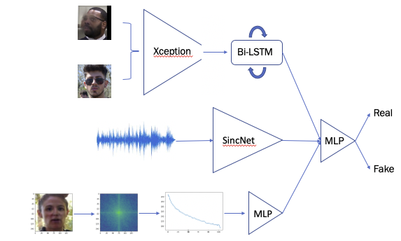
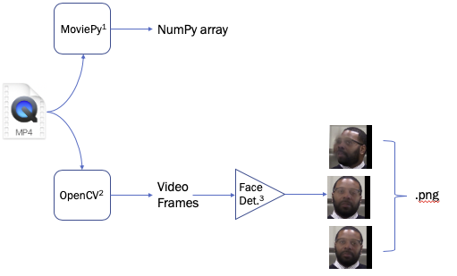

# DeepFakeDetection: Experiments for [DFDC](https://www.kaggle.com/c/deepfake-detection-challenge/)

This repository contains the codebase for the Lab41 submissions to the DFDC. Fig1 illustrates the overall design for the system submitted to the competition.  Ultimately, the algorithm combined the predictions of three individually trained deepfake detectors that processed audio, video and the spatial power spectrum of individual frames.  The predictions from each detector were fed through a multilayer perceptron (MLP) and trained to produce the optimum set of predictions.

|  |
|:--:|
|Fig1: Schematic illustration of overall deepfake detection system design|

## Requirements

The package as well as the necessary requirements can be installed via
```
virtualenv -p /usr/local/bin/python3 venv
source venv/bin/activate
python setup.py install
```

or 

```
virtualenv -p /usr/local/bin/python3 venv
source venv/bin/activate
pip install -e .
```


## Preprocessing

Fig2 illustrates the workflow for offline data preprocessing of the dfdc data. 

|  |
|:--:|
|Fig2: Preprocessing workflow for multimodal deepfake detection challenge|

We have included two preprocessing scripts for audio or video, respectively. Hyperparameters for the preprocessing can be controlled via a yaml file included in the './config' directory. 

For details on the frame preprocessing:

```
python preprocess.py --help
```

For details on the audio preprocessing:

```
python preprocess_audio.py --help
```


## Training

We have provided a sample script used to train the ConvLSTM model on video frames.  Hyperparameters for the training are controlled via a yaml file.  For details regarding the training script:
```
python train.py --help
```


## License

[MIT License](LICENSE)

Copyright (c) 2020 IQT Labs LLC
